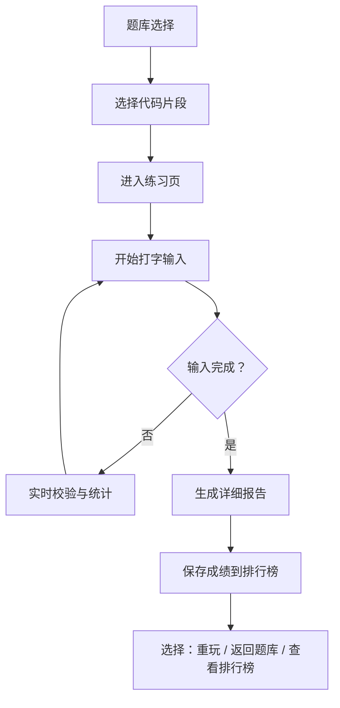

## 1. 产品概述

CodeType 是一款面向程序员的代码打字练习工具，通过逐字敲击真实代码片段来提升编程打字速度和准确率。不同于普通文章打字练习，本产品专注于编程语言的语法结构、符号输入和代码阅读能力训练。

- 核心价值：让程序员在练习打字的同时熟悉真实代码模式，提升编码效率
- 目标用户：程序员、编程学习者、任何希望提升代码输入速度的开发者
- 差异化：内置多语言代码题库、函数级正确率分析、虚拟键盘反馈、多人排行榜

## 2. 核心功能

### 2.1 用户角色

| 角色 | 注册方式 | 核心权限 |
|------|----------|----------|
| 普通用户 | 输入昵称即可（本地存储） | 练习打字、查看排行榜、保存自定义代码 |

### 2.2 功能模块

1. **打字练习页**：代码展示区、实时输入校验、速度与正确率统计、虚拟键盘
2. **题库选择页**：内置代码片段列表、自定义代码列表、语言分类筛选
3. **自定义代码页**：粘贴代码、命名保存、选择语言标签
4. **报告详情页**：打字完成后的详细统计报告
5. **排行榜页**：多用户成绩排名、按关卡筛选

### 2.3 页面详情

| 页面名称 | 模块名称 | 功能描述 |
|----------|----------|----------|
| 打字练习页 | 代码展示区 | 以语法高亮形式展示目标代码，已输入部分显示为正确/错误状态，当前位置有光标指示 |
| 打字练习页 | 实时统计栏 | 显示 CPM（每分钟字符数）、正确率、已用时、剩余字符数 |
| 打字练习页 | 虚拟键盘 | 屏幕键盘，按键按下时高亮显示，提供视觉反馈 |
| 打字练习页 | 用户切换 | 快速切换当前玩家身份 |
| 题库选择页 | 内置题库 | 展示 Python/JavaScript/Go 等多语言代码片段，按难度分级 |
| 题库选择页 | 自定义题库 | 用户保存的代码片段，支持编辑删除 |
| 题库选择页 | 添加按钮 | 跳转到自定义代码添加页面 |
| 自定义代码页 | 代码输入 | 多行文本框粘贴代码，选择语言类型 |
| 自定义代码页 | 保存功能 | 保存到 localStorage，命名后出现在题库列表 |
| 报告详情页 | 总体数据 | 总用时、CPM、正确率、总字符数、错误数 |
| 报告详情页 | 错误键位统计 | 按频率排序的错误按键列表，高亮最常出错的键 |
| 报告详情页 | 函数正确率分析 | 分析代码中各函数定义的正确率，找出最薄弱的函数 |
| 报告详情页 | 重玩按钮 | 重新挑战当前代码片段 |
| 排行榜页 | 排名列表 | 按正确率和用时综合排名，显示玩家昵称、成绩、日期 |
| 排行榜页 | 关卡筛选 | 按不同代码片段筛选排行榜 |

## 3. 核心流程

用户从题库选择一段代码 → 进入打字练习页 → 开始输入，系统实时校验并统计 → 完成后生成详细报告 → 成绩保存到排行榜 → 可重玩或选择其他题目

## 4. 用户界面设计

### 4.1 设计风格

- **设计风格**：赛博朋克 / 终端风格，深色主题
- **主色调**：深黑背景 `#0a0a0f`，霓虹青 `#00ffd5` 作为主强调色
- **辅助色**：错误红 `#ff4757`，正确绿 `#2ed573`，紫色点缀 `#a855f7`
- **字体**：代码区使用等宽字体（JetBrains Mono / Fira Code），UI 使用现代无衬线字体
- **按钮风格**：圆角矩形，霓虹发光边框效果，悬停时亮度增强
- **布局风格**：卡片式布局，带细微边框发光效果，玻璃拟态质感

### 4.2 页面设计概述

| 页面名称 | 模块名称 | UI 元素 |
|----------|----------|---------|
| 打字练习页 | 代码展示区 | 深色背景卡片，语法高亮，逐字符变色，光标闪烁动画 |
| 打字练习页 | 统计栏 | 四个数据卡片横向排列，数字大字号，标签小字号 |
| 打字练习页 | 虚拟键盘 | 底部固定，按键带阴影，按下时有缩放和发光动画 |
| 题库选择页 | 题目卡片 | 网格布局，卡片显示语言标签、难度、代码预览一行 |
| 报告详情页 | 数据可视化 | 错误键位用条形图展示，函数正确率用进度条展示 |
| 排行榜页 | 排名列表 | 前三名特殊样式（金/银/铜色边框），带排名序号 |

### 4.3 响应式

- 桌面端优先设计，大屏幕优化体验
- 平板端自适应布局，虚拟键盘可折叠
- 手机端简化显示，虚拟键盘隐藏（使用系统键盘）

### 4.4 动效设计

- 页面入场：元素从下往上渐入，带轻微延迟差
- 按键反馈：按下时缩放 95%，释放回弹，带光晕扩散
- 错误提示：字符变红时轻微抖动动画
- 光标闪烁：经典终端光标闪烁效果
- 报告生成：数据数字从 0 滚动到目标值
