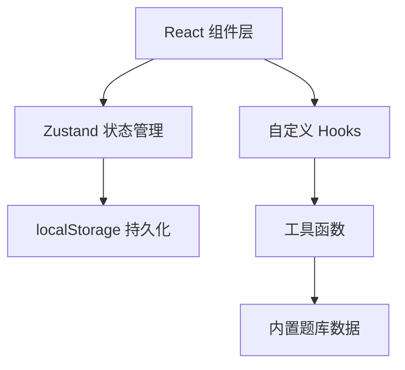

## 1. 架构设计

本项目为纯前端单页应用，所有数据存储在浏览器 localStorage 中，无需后端服务。



## 2. 技术描述

- **前端框架**：React@18 + TypeScript
- **构建工具**：Vite@5
- **样式方案**：Tailwind CSS@3
- **状态管理**：Zustand
- **路由管理**：React Router DOM@6
- **图标库**：Lucide React
- **数据存储**：localStorage（浏览器本地存储）
- **代码高亮**：Prism.js 或自定义逐字符着色

## 3. 路由定义

| 路由 | 页面 | 用途 |
|------|------|------|
| `/` | 首页 / 题库选择页 | 展示所有可用的代码片段，选择开始练习 |
| `/practice/:id` | 打字练习页 | 核心打字练习界面 |
| `/custom` | 自定义代码页 | 添加新的自定义代码片段 |
| `/report/:id` | 报告详情页 | 展示打字完成后的详细统计 |
| `/leaderboard` | 排行榜页 | 展示多用户成绩排名 |

## 4. 数据模型

### 4.1 代码片段 (CodeSnippet)

```typescript
interface CodeSnippet {
  id: string;
  title: string;
  language: 'python' | 'javascript' | 'go' | 'rust' | 'java' | 'custom';
  difficulty: 'easy' | 'medium' | 'hard';
  code: string;
  isCustom?: boolean;
  createdAt?: number;
}
```

### 4.2 打字记录 (TypingRecord)

```typescript
interface TypingRecord {
  id: string;
  snippetId: string;
  playerName: string;
  cpm: number;           // 每分钟字符数
  accuracy: number;      // 正确率 0-100
  totalTime: number;     // 总用时（秒）
  totalChars: number;    // 总字符数
  errorCount: number;    // 错误总数
  errors: KeyError[];    // 错误键位统计
  functionStats: FunctionStat[];  // 函数正确率统计
  timestamp: number;
}
```

### 4.3 错误键位统计 (KeyError)

```typescript
interface KeyError {
  expected: string;   // 期望的字符
  typed: string;      // 实际输入的字符
  count: number;      // 错误次数
}
```

### 4.4 函数正确率统计 (FunctionStat)

```typescript
interface FunctionStat {
  name: string;       // 函数名
  totalChars: number; // 函数体总字符数
  errorChars: number; // 错误字符数
  accuracy: number;   // 正确率
}
```

### 4.5 玩家 (Player)

```typescript
interface Player {
  name: string;
  totalGames: number;
  bestCpm: number;
  bestAccuracy: number;
}
```

### 4.6 localStorage 存储键

- `codetype_snippets` - 自定义代码片段
- `codetype_records` - 所有打字记录
- `codetype_current_player` - 当前玩家名称

## 5. 目录结构

```
src/
├── components/          # 可复用组件
│   ├── VirtualKeyboard/  # 虚拟键盘组件
│   ├── CodeDisplay/      # 代码展示组件
│   ├── StatsBar/         # 统计栏组件
│   ├── SnippetCard/      # 题目卡片组件
│   ├── Leaderboard/      # 排行榜组件
│   └── Report/           # 报告详情组件
├── pages/               # 页面组件
│   ├── Home.tsx          # 首页/题库选择
│   ├── Practice.tsx      # 打字练习页
│   ├── CustomCode.tsx    # 自定义代码页
│   ├── Report.tsx        # 报告详情页
│   └── Leaderboard.tsx   # 排行榜页
├── hooks/               # 自定义 hooks
│   ├── useTypingGame.ts  # 打字游戏核心逻辑
│   └── useLocalStorage.ts # localStorage 封装
├── store/               # Zustand stores
│   └── useAppStore.ts    # 全局应用状态
├── data/                # 静态数据
│   └── snippets.ts       # 内置代码题库
├── utils/               # 工具函数
│   ├── codeAnalyzer.ts   # 代码分析（函数提取等）
│   └── statistics.ts     # 统计计算工具
├── types/               # TypeScript 类型定义
│   └── index.ts
├── App.tsx
├── main.tsx
└── index.css
```

## 6. 核心功能实现思路

### 6.1 打字校验逻辑

- 将目标代码拆分为单个字符数组
- 维护当前输入位置索引
- 用户每输入一个字符，与目标字符对比
- 正确则前进，错误则记录错误并仍前进（或允许退格修正）
- 实时计算已输入字符数、正确数、错误数

### 6.2 函数正确率分析

- 使用正则表达式匹配代码中的函数定义
- 记录每个函数的起止字符位置
- 打字完成后统计每个函数区域内的错误数
- 计算各函数的正确率并排序

### 6.3 虚拟键盘

- 预定义标准 QWERTY 键盘布局
- 监听 keydown/keyup 事件
- 根据按下的键高亮对应虚拟按键
- 支持显示 Shift 组合键状态

### 6.4 排行榜排序规则

- 主要按正确率降序
- 正确率相同时按 CPM 降序
- 再相同按用时少者优先
